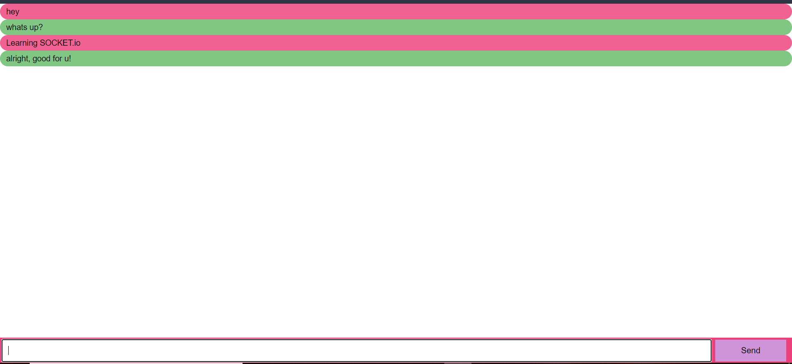

# Chat-Socket-Server fun project

This project is for more of fun to learn more of Socket.io and NodeJS by myself.
Below simple screenshot is attached.

At the moment it is one way direction, I want to make it bi-directional in near future :).

## Run this project

`node server.js`

This is will be listening port number 3000 on localhost.
Open the browser and start talking to yourself :P 